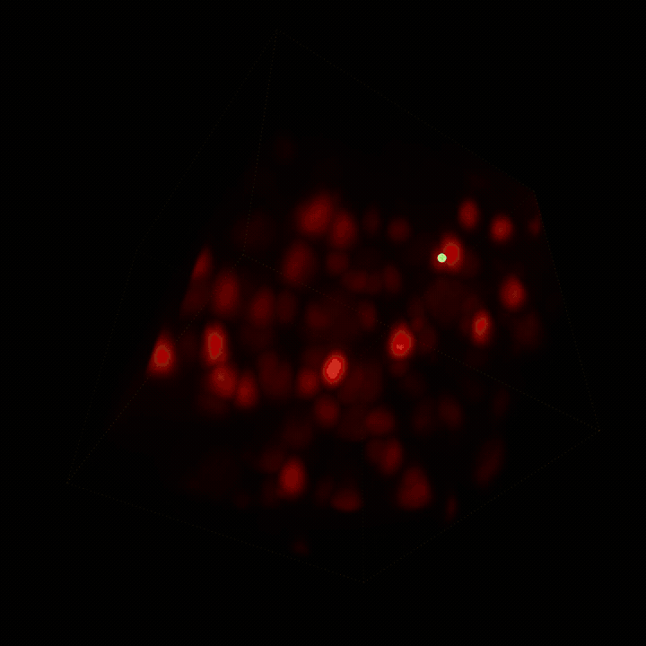

# Biohub – Cell Tracking During Development

<p align="center">
  
</p>

<p align="center">
  <a href="https://www.kaggle.com/competitions/biohub-cell-tracking-during-development"></a>
  <a href="docs/3_strategy.md"></a>
  <a href="pyproject.toml"></a>
  <a href="LICENSE"></a>
</p>

Personal entry for the Kaggle competition
[Biohub – Cell Tracking During Development](https://www.kaggle.com/competitions/biohub-cell-tracking-during-development):
detecting and linking cells in 3D through time in zebrafish embryo
microscopy videos, scored on sparse ground-truth edge and division
matching. Full task, data format, and metric details:
[`docs/1_instructions.md`](docs/1_instructions.md).

## Approach

A learned detect → link pipeline: the competition's official baseline
architecture (`TemporalUNet3D` center detector + cross-attention node
transformer + ILP graph optimizer — see [`NOTICE.md`](NOTICE.md) for
attribution). A deterministic graph-repair stage (short-track pruning,
bounded gap recovery) is implemented on top — every top-scoring public
solution reviewed converges on that shape — but validated against real
data as **currently regressing the score** (edge Jaccard -0.0133), so it's
off by default pending root-cause. See
[`docs/3_strategy.md`](docs/3_strategy.md) for the full competitive-landscape
analysis and the validated finding.

## Current best result

No leaderboard score yet. `notebooks/02_baseline_modeling.ipynb` produces a
schema-valid `submission.csv` end-to-end on Kaggle GPU using the pretrained
`unet_transformer` checkpoint (graph repair off — see "Approach" above);
not yet uploaded to the competition (a separate, deliberate action — see
the notebook's "Submitting to Kaggle" section). See
[`docs/3_strategy.md`](docs/3_strategy.md) for the prioritized
next-experiment roadmap.

## Repository layout

- [`notebooks/`](notebooks/) — the executable workflow: `01_eda.ipynb`,
  `02_baseline_modeling.ipynb`, plus `notebooks/kernels/<name>/` holding
  each notebook's Kaggle `kernel-metadata.json`.
- [`docs/`](docs/) — `0` project standards, `1` competition instructions,
  `2` EDA findings, `3` competitive-landscape strategy/roadmap, plus the
  vendored `metrics.md` (official scoring spec).
- [`src/tracking_cellmot/`](src/tracking_cellmot/) — vendored, tested I/O +
  metrics + model library from the official baseline (107 tests).
  Not executed directly on Kaggle (kernels mount a public pretrained-model
  dataset with its own copy instead) — kept locally as a tested reference
  and for training a customized checkpoint later; see
  [`docs/0_coding_standards.md`](docs/0_coding_standards.md).
- [`scripts/`](scripts/) — vendored train/predict/evaluate/conversion CLIs
  (same status as `src/`), plus `push_kaggle_kernel.sh <eda|baseline>`, the
  one script written for this project.

## Setup

```bash
uv sync --extra dev --extra notebook --extra kaggle
uv run pytest -m "not slow"   # fast tests, no dataset needed
```

The competition dataset (~87.6 GB) is never downloaded locally — everything
that touches real data runs on Kaggle Kernels, where it's already mounted.
See [`docs/0_coding_standards.md`](docs/0_coding_standards.md) for
project-specific conventions and deliberate deviations from the personal
master standard.
