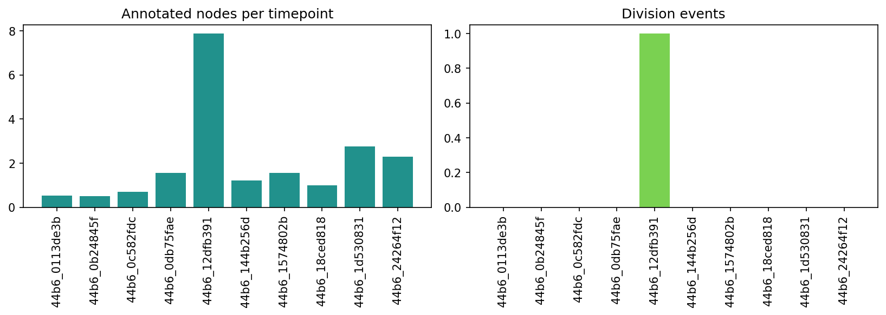
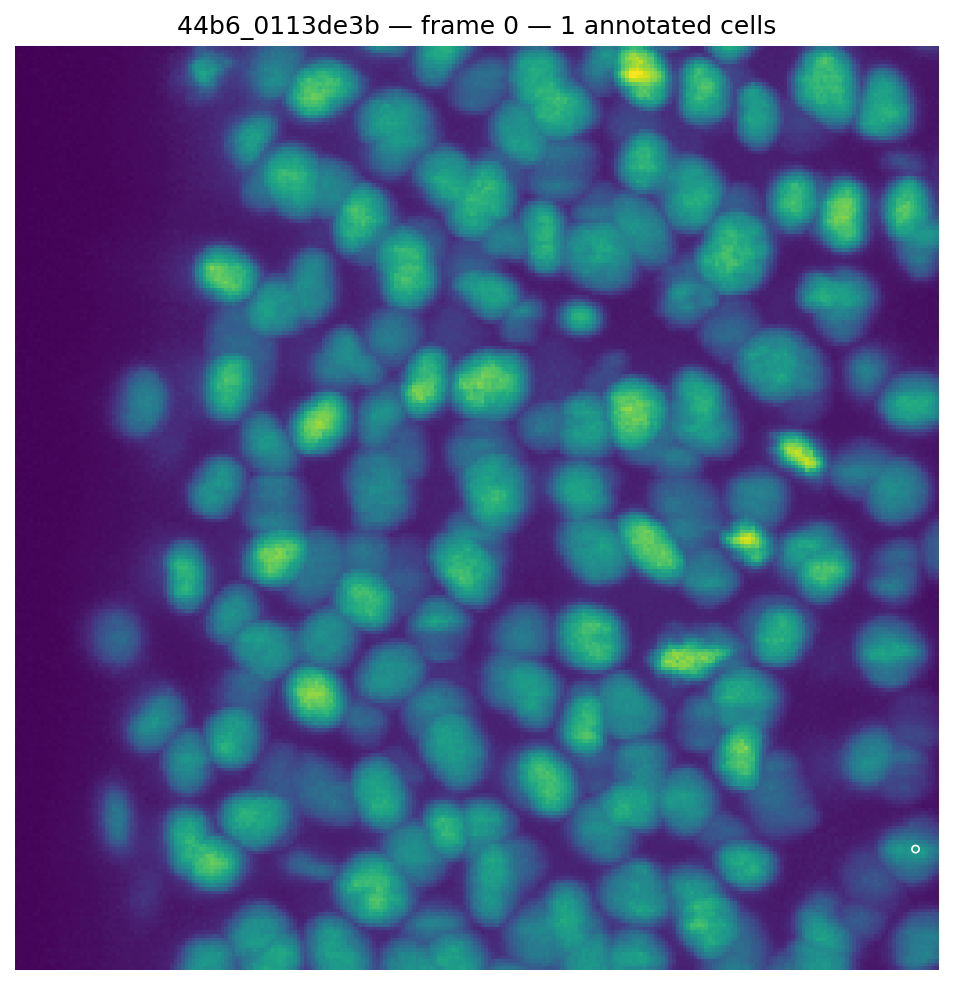
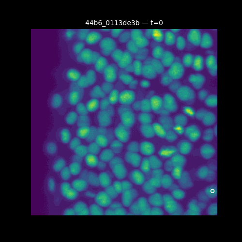

# EDA Insights

From `notebooks/01_eda.ipynb`'s trusted runs on Kaggle, most recently
2026-07-22 (kernel `tuannm3812/biohub-eda`, version 8, `COMPLETE`). Charts,
tables, and the animated preview below are pulled directly from that run's
saved output (`kaggle kernels output`) — not regenerated or estimated —
and mirror what renders on the kernel page itself
(kaggle.com/code/tuannm3812/biohub-eda).

## Dataset scale

- **199 train videos** with ground truth, **4 test videos**. Confirmed via
  `01_eda.ipynb` section 2's `list_datasets` call against the real
  competition mount (`/kaggle/input/competitions/.../test`, not the
  artifacts dataset), so this is the actual held-out test set, not a
  partial slice.
- All **10 surveyed train videos share an identical shape and scale**:
  `(T=100, Z=64, Y=256, X=256)`, `uint16`, voxel scale `(1.625, 0.4062,
  0.4062)` µm (Z, Y, X) — i.e. Z is **4× coarser** than X/Y. No shape/scale
  variation found across this sample, so a single global `--det-threshold`
  (rather than a per-video one) is reasonable, at least for this slice of
  the dataset. Every public reference notebook reviewed (`docs/3_strategy.md`)
  treats this anisotropy explicitly; our vendored baseline already gates
  distances in µm internally (`src/tracking_cellmot/metrics.py`,
  `pool_kernel_um` in `predict_unet_transformer.py`), so this is handled,
  not a gap.

## Ground truth is genuinely, and very unevenly, sparse

| dataset | nodes/timepoint | annotated nodes | estimated true nodes | annotated fraction |
|---|---:|---:|---:|---:|
| 44b6_0b24845f | 0.51 | 51 | 32,795 | 0.16% |
| 44b6_0113de3b | 0.52 | 52 | 25,755 | 0.20% |
| 44b6_0c582fdc | 0.71 | 71 | 27,958 | 0.25% |
| 44b6_18ced818 | 1.00 | 100 | 78,644 | 0.13% |
| 44b6_144b256d | 1.21 | 121 | 65,376 | 0.19% |
| 44b6_1574802b | 1.55 | 155 | 17,677 | 0.88% |
| 44b6_0db75fae | 1.57 | 157 | 15,335 | 1.02% |
| 44b6_24264f12 | 2.30 | 230 | 26,353 | 0.87% |
| 44b6_1d530831 | 2.76 | 276 | 35,825 | 0.77% |
| 44b6_12dfb391 | 7.88 | 788 | 58,672 | 1.34% |

Two findings, not one:

1. **The ground truth annotates roughly 0.1%–1.3% of the estimated true
   cell count** (`annotated_fraction`, from `estimated_number_of_nodes` —
   present on **10/10** surveyed videos). This is a far stronger, *measured*
   sparsity statement than "52 nodes on a volume that probably has more
   cells" — the true cell count is 15,000–79,000 per video, and only
   dozens-to-hundreds are annotated.
2. **Annotation density varies ~15× across videos** (0.51 to 7.88 nodes
   per timepoint) with no visible correlation to the true-count estimate
   (the sparsest-annotated video, 44b6_18ced818, has the *highest*
   estimated true count). The single video used for the section-5 deep
   dive (`44b6_0113de3b`, 0.52 nodes/timepoint) sits at the **low end** of
   this range — conclusions from it alone (e.g. on divisions, below)
   shouldn't be over-generalized to the full 199-video train set.

## Divisions are rare, not just under-annotated in one sample

Only **1 division event across all 10 videos' combined 1,000 timepoints**
(in `44b6_12dfb391`, itself the highest-annotation-density video). This
directly answers the open question `01_eda.ipynb` section 5 raised from a
single video (0 divisions in `44b6_0113de3b`) — a wider sample still shows
divisions are rare, not simply missed in one under-annotated clip. Consistent
with `02_baseline_modeling.ipynb`'s validation finding that the current
checkpoint gets 0 division_jaccard credit, and with seshurajup's 0.857
public reference solution (`docs/3_strategy.md`) disabling division
recovery entirely. Division recovery remains low-priority (10% metric
weight) until edge/detection quality is solid — see `docs/3_strategy.md`'s
roadmap.

## `estimated_number_of_nodes` is not available on the test set

**0/4 test videos have `estimated_number_of_nodes`** — confirmed by
directly reading each test video's `zarr.json` (`01_eda.ipynb` section 4).
This isn't a partial or differently-keyed result: the test videos ship no
`.geff` at all, since they carry no ground truth, and this field lives
inside a `.geff`'s metadata. Any strategy that calibrates `DET_THRESHOLD`
(or similar count-affecting parameters) per test video against its
estimated true cell count is therefore **not implementable** — the signal
it depends on doesn't exist at inference time on the real test set, only
on train. This directly bears on why the `DET_THRESHOLD=0.90` sweep
(`docs/4_experiments.md`) didn't transfer: of the two hypotheses raised
there, the count-budget one specifically assumed this field (or a
correlate of it) could inform calibration — it can't, at least not this
way. The multiple-comparisons hypothesis is now the more likely
explanation. See `docs/3_strategy.md`.

## Visual check: do annotations land on real cells?

`01_eda.ipynb` section 5 flagged this as worth checking directly — a
mismatched annotation would signal a scale/orientation bug worth catching
before trusting anything downstream. The real rendered frame confirms
detections do land on real nuclei, not background, and makes the sparsity
finding above viscerally obvious: dozens of clearly visible nuclei in a
single max-intensity-projection frame, only one small white circle marking
the single annotated cell.

The animated preview (30 consecutive timepoints, same video) shows the same
pattern holding across time — the annotated track moves plausibly with a
real nucleus rather than jumping around, but the overwhelming majority of
visible cells in every frame stay unannotated throughout:

## What to do next

- Rerun the multi-video stats table with `N_VIDEOS_FOR_STATS = None` (all
  199, not just 10) now that Kaggle runtime is known to be fast, to confirm
  the ~15× density spread and shape/scale consistency found here hold
  across the full train set, not just this sample of 10.
- The `estimated_number_of_nodes`-based calibration idea is closed off
  (see above) — focus instead on distinguishing the multiple-comparisons
  hypothesis for the `DET_THRESHOLD` miss, per `docs/3_strategy.md`'s
  roadmap.
